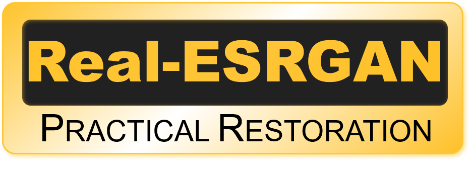

# Real-ESRGAN Image/Video Upscaler (Streamlit)

<p align="center">
  
</p>
A lightweight Streamlit UI around Real-ESRGAN for upscaling videos and images. It supports GPU inference, adjustable tiling, FP16, denoise control for the general v3 model, multi-image batch processing, and robust video encoding.

<p align="center">
  
</p>

## Features
- Image and video upscaling with Real-ESRGAN
- Models: `realesrgan-x4plus`, `realesrnet-x4plus`, `realesr-general-x4v3` (with denoise)
- Denoise strength slider for `realesr-general-x4v3` via DNI blending
- Image mode: single or multi-image upload; ZIP download for batches
- Video mode: keeps original audio (optional); CRF quality control
- Performance: JPEG frame extraction, CUDA decode, FP16, tiling controls
- Cancellation: Stop button halts ffmpeg and processing cleanly
- Large uploads: 1 GB upload limit via `.streamlit/config.toml`
- Persistent outputs under `/workspace/output`

## Quick Start

Docker (recommended):

```
# Start the app (requires NVIDIA runtime)
docker-compose up --build
# Open http://localhost:8501
```

Prerequisites:
- NVIDIA driver installed on host + nvidia-container-toolkit
- GPU with enough VRAM for desired tile size or set `tile > 0`

## Usage

- Open the app and select Input type: `Video` or `Image`.
- Choose Model and settings in the sidebar:
  - `Model`: `realesrgan-x4plus`, `realesrnet-x4plus`, or `realesr-general-x4v3`
  - `Upscale factor`: 2, 3, or 4
  - `Tile size`: 0 = no tiling (fast but high VRAM). Larger values (e.g., 256) improve cancel responsiveness
  - `Tile padding`: reduce if no seams are visible
  - `FP16`: enable for best throughput on supported GPUs
  - `Denoise strength (general-x4v3)`: appears only when that model is selected (0.0 strong denoise → 1.0 minimal)
  - Video-only: `Keep original audio`, `CRF` (quality/size)
- Upload file(s) and click Start.
- For images, a ZIP download is provided; for videos, an MP4 is produced.

## Outputs & Paths
- Outputs are saved under `/workspace/output` inside the container:
  - Video: `/workspace/output/sr_<original>.mp4`
  - Images: `/workspace/output/sr_<original>.png`
  - Multi-image ZIP: `/workspace/output/sr_images_<run_token>.zip`
- Per-run scratch lives at `/workspace/output/run_<run_token>/` (frames, temp files).

With the default `docker-compose.yml`, your project folder is mounted to `/workspace`, so outputs appear at `./output` on the host.

## Model Weights
Place weights in either location (container paths):
- `/workspace/data/models`

The app attempts to download these if not present. In restricted environments, download manually into `data/models/` on the host.

## Performance Tips
- Disable tiling (`tile=0`) if your GPU has enough VRAM for the frame size.
- Keep FP16 enabled.
- JPEG frames and CUDA decode are already used for faster I/O.


## Configuration
- Upload limit: `.streamlit/config.toml` sets `maxUploadSize = 1024` (1 GB)
- Model search path and outputs are configurable in `streamlit_app.py` near the top-level helpers


## Project Structure
- `streamlit_app.py` — Streamlit UI and pipeline
- `Real-ESRGAN/` — Upstream Real-ESRGAN submodule/code
- `data/models/` — Place model weights here (mounted on host)
- `output/` — Outputs and per-run scratch
- `Dockerfile`, `docker-compose.yml` — Container setup
- `.streamlit/config.toml` — Streamlit config (upload size)

## Acknowledgements
- Real-ESRGAN by Xintao et al. https://github.com/xinntao/Real-ESRGAN

